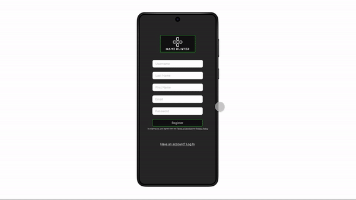

# Game Hunter

>✒️ __Autores__: José Maximiliano B. M. (@mackstm), Nabil L.A. (@nalleon)

    

 

## Índice

- [Herramientas](#herramientas)
- [Idea](#idea)
- [Wireframe](#wireframe)
- [Mockup](#mockup)
- [Prototipo](#prototipo)
 

***

### Herramientas 

Las dos herramientas principales que hemos utilizado a lo largo de esta tarea han sido:

- <a href="https://balsamiq.com/">Balsamiq</a> (Wireframe)

- <a href="https://www.figma.com">Figma</a> (Mockup y Prototype)

    
    

Puede encontrar nuestro proyecto [aquí](https://www.figma.com/design/qIMrElrlntaXp2e9UN5HOv/Mockup?node-id=0-1&t=SEKcfCPvjLvh0v3L-1)

 

***

###  Idea 

Nuestra idea se basa en crear un portal de búsqueda de videojuegos de segunda mano en vista a la búsqueda de videojuegos no tan actuales con el objetivo de coleccionismo. Además, aparte de esto, los usuarios podrán poner a la venta sus propios juegos en la aplicación para venderlos.

Cabe destacar que una parte en la que deseamos hacer énfasis es en la comparativa de precios, con una posible gráfica del juego por parte de distintos vendedores para facilitar la compra y la selección del producto. Es decir, que podamos consultar el precio del mismo juego en Ebay, Game y en la propia app.

También, en base a los géneros de los juegos que haya mirado y/o comprado un usuario, se le recomendarán ciertos productos que le podrían interesar. Por ejemplo si un usuario ha estado mirando juegos de la saga Final Fantasy, se le recomendarán juegos de esa saga y otros con los que comparta géneros (por ejemplo: Xenogears y Chrono Trigger como otros JRPG).

En su perfil, el usuario podrá archivar según su preferencia como pública, solo para amigos o privada su colección, ya que esto puede ser de ayuda para llevar un registro y además añade un componente social.
La función del chat así como la creación de grupos está enfocada a poder compartir ofertas de posible interés. Además facilita en gran medida la comunicación entre el vendedor y posibles compradores.

 

***

### Wireframe 

Nuestra idea básica del wireframe principal es esta:

    

 

***

### Mockup 

Hemos pensado en añadir una personalización de los colores dentro del modo oscuro y claro de la aplicación, en este caso el color de los detalles es verde, pero podría ser cambiado por otros colores como el rojo, morado, azul, etc.

- Versión para móviles:

    

 

- Versión para escritorio:

    

 

- Versión para tablet:

    

 

***

### Prototipo 

Ejemplo de flujo básico para registrarse e iniciar sesión en la aplicación.

 

